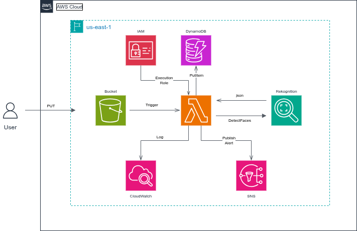
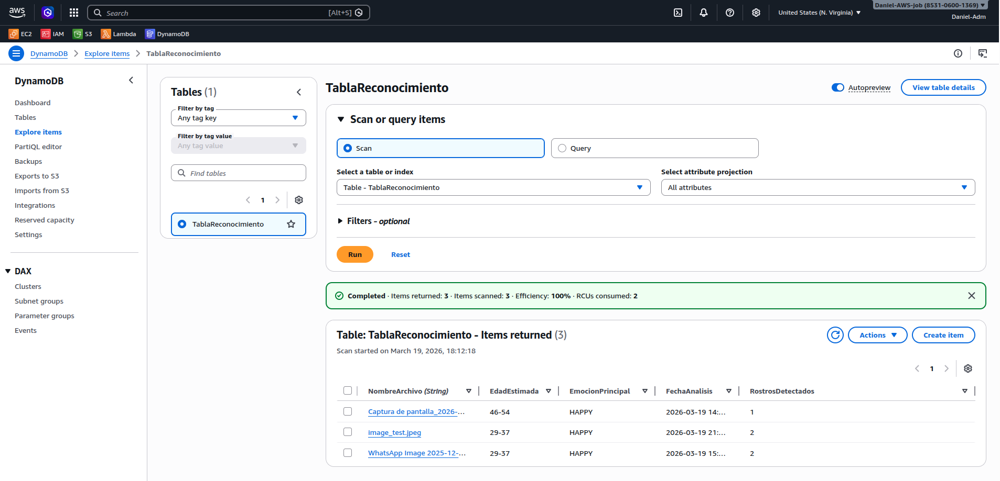
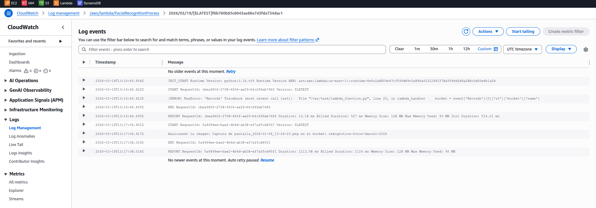

# 🤖 Reconhecimento Facial Serverless com AWS AI

## 📝 Sobre o Projeto
Este projeto prático demonstra a construção de uma arquitetura **Event-Driven (Orientada a Eventos)** e **Serverless** na AWS. O objetivo é processar imagens automaticamente assim que é feito o upload, utilizando Inteligência Artificial para detectar rostos, estimar idades e identificar emoções, armazenando os resultados e enviando alertas em tempo real.

## 🏗️ Arquitetura do Projeto

**Fluxo de Funcionamento:**
1. O usuário faz o upload de uma imagem (`PUT`) em um bucket do **Amazon S3**.
2. O S3 gera um evento (Trigger) que invoca uma função **AWS Lambda** (código disponível em `src/lambda_function.py`).
3. A Lambda envia a imagem para o **Amazon Rekognition** (IA) através da API `DetectFaces`.
4. O Rekognition retorna um payload em JSON com os metadados faciais.
5. A Lambda processa os dados e salva os resultados (Idade, Emoção, etc.) em uma tabela do **Amazon DynamoDB**.
6. Simultaneamente, a Lambda publica uma mensagem no **Amazon SNS**, que envia um alerta por e-mail ao administrador.
7. Todos os logs de execução são registrados no **Amazon CloudWatch**.

## 🛠️ Tecnologias e Serviços Utilizados
* **Amazon S3:** Armazenamento de objetos (Input).
* **AWS Lambda:** Computação Serverless (Lógica de negócio em Python/Boto3).
* **Amazon Rekognition:** Serviço de Machine Learning para análise de imagens.
* **Amazon DynamoDB:** Banco de dados NoSQL (Armazenamento de metadados).
* **Amazon SNS:** Serviço de mensageria (Notificações por e-mail).
* **AWS IAM:** Gerenciamento de permissões com o princípio do menor privilégio (Least Privilege).

## 🔍 Troubleshooting & Aprendizados (Desafios Resolvidos)

Durante a implementação, enfrentei e resolvi desafios técnicos reais de engenharia cloud:

* **Permissões de Execução da Lambda:** Inicialmente, a Lambda não conseguia gravar logs no CloudWatch. Diagnostiquei o erro `ResourceNotFoundException` e resolvi anexando a política `AWSLambdaBasicExecutionRole` ao IAM Role da função.
* **URL Encoding em Nomes de Arquivos (O Bug dos Espaços):** Quando fiz o upload de imagens com espaços no nome (ex: `WhatsApp Image.jpeg`), o S3 converteu os espaços no caractere `+`. Isso causou um erro no Rekognition, que não encontrava o arquivo. Resolvi isso importando a biblioteca `urllib.parse` no Python e utilizando `unquote_plus()` para decodificar o nome do arquivo antes de passá-lo para a IA.
* **Formatação de ARNs no Evento de Teste:** Aprendi que a API do Rekognition exige o nome exato do bucket e não aceita o formato ARN (`arn:aws:s3:::...`), corrigindo os payloads de teste manual no console da Lambda.

## 📸 Evidências de Funcionamento

**1. Dados processados e salvos no DynamoDB:**

**2. Alerta recebido via SNS:**

## 👨‍💻 Autor
**Daniel Villegas**
* Cloud Architect | AWS Certified

* 